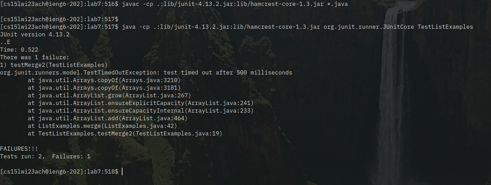

# Lab Report 4

For this lab report, I'm going to record the actions taken to perform each of the following steps, as efficiently as possible.

* Log into ieng6
* Clone your fork of the repository from your Github account
* Run the tests, demonstrating that they fail
* Edit the code file to fix the failing test
* Run the tests, demonstrating that they now succeed
* Commit and push the resulting change to your Github account

As is common in the Linux world, I'll use the `C-` and `M-` prefixes for the Control and Alt keys respectively (so `C-a` means "Control a").

I'm writing this report in `vim` inside of a terminal, which is running `tmux` on my local machine. I'll press `C-a c` to open a new pane. Then, since I have [`zoxide`](https://github.com/ajeetdsouza/zoxide) installed locally, I can use `z cse_15l` to jump straight to my CSE 15L directory. From here, I type `./con<tab>`, which autocompletes to `./connect`, a bash script that contains

```bash
#!/bin/bash

TERM=screen-256color ssh cs15lwi23ach@ieng6.ucsd.edu
```


I'll press `<enter>` to run that, `ssh`-ing into my course account on `ieng6`. Then, jumping over to my fork of the lab report (locally, `M-1` to go to first workspace, where I have Firefox running), and copy the ssh download link, `git@github.com:ritobanrc/lab7.git`. Back in the terminal, first `rm -rf lab7`, then `<enter>`, because I forgot to clear the directory from last time, then `git clone`, then `C-Shift-V` to paste the SSH link, then `<enter>`. Then `ls<enter>` to check where I am, `cd lab<tab>` to enter the `lab7` directory, then `<C-r>javac <enter>`, which autocompletes to `javac -cp .:lib/junit-4.13.2.jar:lib/hamcrest-core-1.3.jar *.java` and compiles the code.


Then, `<C-r>java <enter>` (not that the space is necessary so it doesn't autocomplete to the `javac` command) autocompletes to `java -cp .:lib/junit-4.13.2.jar:lib/hamcrest-core-1.3.jar org.junit.runner.JUnitCore TestListExamples`, which runs the tests with the following output:



Then, to fix the test, I'll open `vim <tab>List<tab>`, which will edit `vim ListExamples.java`, then because `vim` seems to have saved my cursor, I can just do `s2` to replace the `index1` with `index2`, and finally `:wq` to save.


Next, after `<up><up><enter>` and `<up><up><up><enter>`, the tests are fixed!


Finally, `git add ListExamples.java`, `git commit -m "fixed it!"`, and `git push` completes commiting the change to Github.


