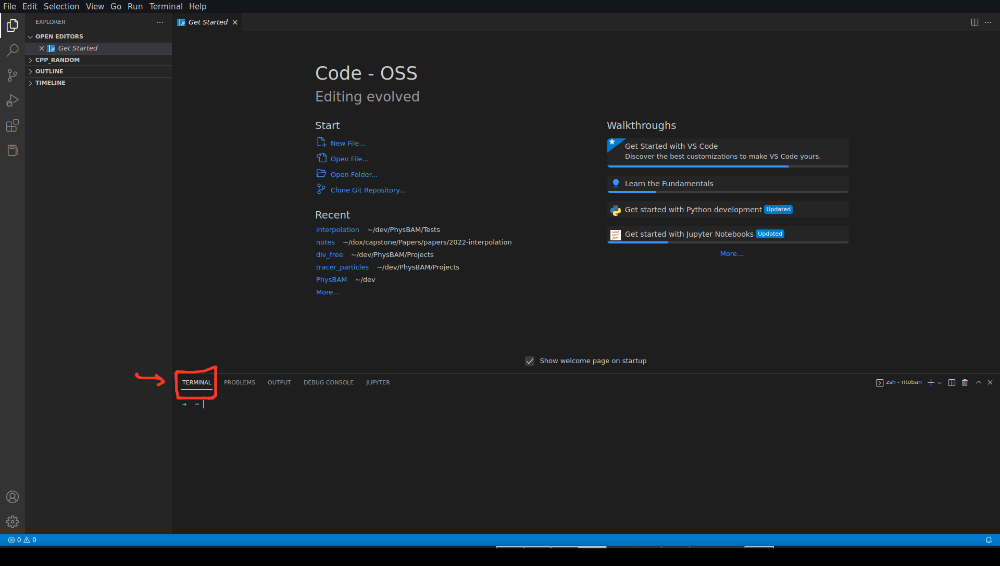
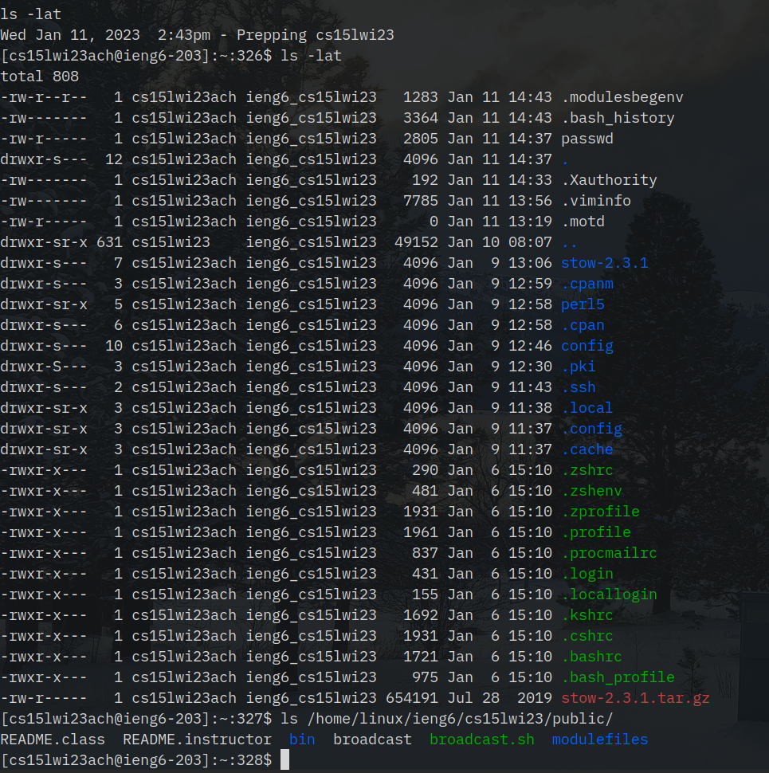
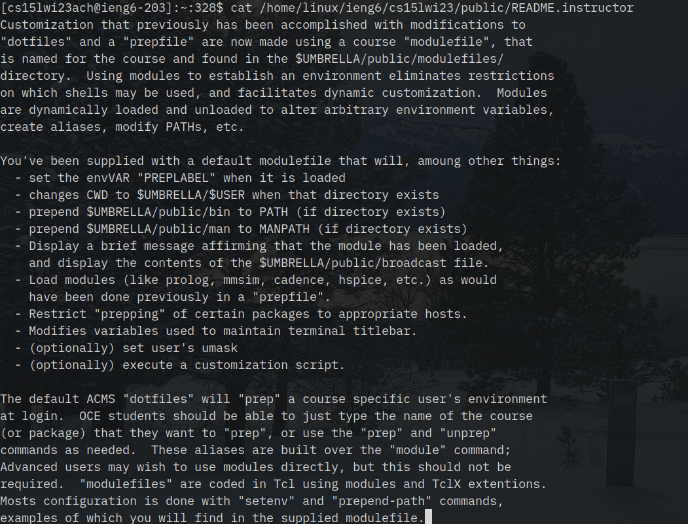
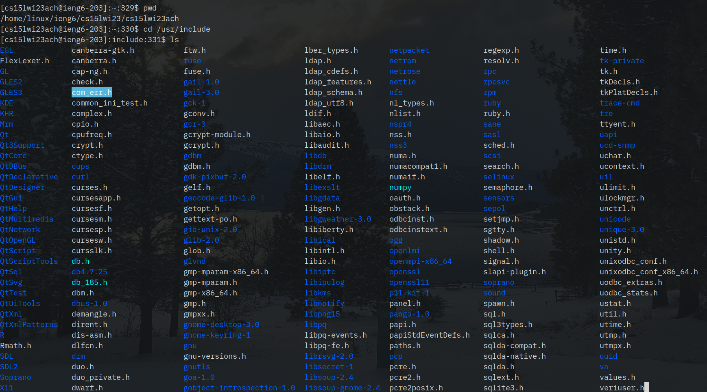

# Week 1 Lab Report

Computer science courses often require logging in to a remote machine in order to do work. They often also have course-specific accounts setup on these machines, setup with software necessary for the course. I'll show you how to log in to such an account at UCSD in this post!

## Getting a Terminal
First, you'll need a terminal. The easiest way to get this is to install VSCode (which I already had on my computer, and you probably will too!). To install VSCode on Linux, open up your Software Center (on my machine, there's a desktop shortcut with the name "Add/Remove Software") and search for `code`. Click the result that says something like "Code - OSS" (OSS refers to "open source software" -- most Linux distributions only include the purely open-source version of VSCode in their repos, rather than the version that includes Microsoft's closed-source addons, which is fine for most purposes), and press the Install button (you will have an "Install" button where mine says "Remove" in the following image).


Alternatively, if you're comfortable using a terminal, you can also install it with one of the following commands, depending on your distribution:
* `sudo pacman -S code` on Arch Linux (or other Arch-based distributions)
* `sudo apt install code` on Debian or Ubuntu
* `sudo dnf install code` on Fedora or similar
* and if you're using something obscure like Gentoo which makes you compile programs on your own from source, I'm sure you can figure it out :D

Finally, if you're on MacOS or Windows, you'll need to go to the [VSCode website](https://code.visualstudio.com/), and press the download button. From there, you should just be able to click through the installer.

Once you have VSCode open, click the terminal button as shown below:


Alternatively, just open a terminal directly (I'm going to be using [`alacritty`](https://github.com/alacritty/alacritty) for the rest of the tutorial), but everything should just work identically if you're using VSCode's terminal or some other terminal.

## Remotely connecting
Now, you'll need to get your course-specific user account. At UCSD, you can get this from [UCSD's ETS Account Lookup](https://sdacs.ucsd.edu/~icc/index.php). After putting your AD username and student ID in, then click the button that says something like `cs15lwi23abc`. That's your username. You'll need to follow the rather convoluted instructions [here](https://docs.google.com/document/d/1hs7CyQeh-MdUfM9uv99i8tqfneos6Y8bDU0uhn1wqho/edit) to reset your password the first time [^1].

Now, once you have your username and password, you'll log into `ieng6.ucsd.edu`. Run the following command in your terminal (replacing `abc` with your own username).

```bash
ssh cs15lwi23ach@ieng6.ucsd.edu
```

You'll have to type `yes` in to the "The authenticity of host 'ieng6.ucsd.edu (128.54.70.227)' can't be established." message the first time you connect, and then type in your password, but after that, you should see something like this:


I have a `TERM=screen-256color` before my `ssh` command. This is just because I'm using `tmux` on my local computer, and `ieng6` gives a bunch of `tput: unknown terminal "tmux-256color"` errors and doesn't show the bolding or colors correctly (incidentally, it also does not recognize `alacritty` as a terminal, the same trick fixes it there).

## Try running some commands
Finally, now that you're running commands on `ieng6`, try poking around. Here are some examples (I already have some files in my home directory, don't worry if you have a lot fewer):

Here's an example of me poking around (as is common in Linux systems, you can find all sorts of information if you know where to look, like instructions about how to _setup_ a class as an instructor, or all the header files you might include if you're writing a C/C++ program).

```bash
ls -lat
ls /home/linux/ieng6/cs15lwi23/public/
cat /home/linux/ieng6/cs15lwi23/public/README.instructor
pwd
cd /usr/include
ls
```

A few words about each of these commands:
* `ls` lists all of the files inside of a directory. `-l` lists them out in long form with many extra details, like file size and permissions. `-a` includes hidden files, which are files/folders whose names begin with a  `.` (think "all" to remember it). `-t` sorts the results by time. You can write all of these options separately, as `ls -l -a -t`, or put them together as `ls -lat`
* `cat` prints out the contents of a file to the terminal. 
* `pwd` prints the current working directory, which to start, will just be the home directory, something like `/home/cs15lwi23abc`
* `cd` changes the current working directory. If you run `pwd` again after `cd` you will see it updated, and if you run `ls` after that. `ls` in `/usr/include` shows you all the header files that are installed on your system that you might include in a C/C++ program.

Here's the output from those commands (long outputs have been truncated for space).





As you can see, poking around a Linux system can be very fruitful -- have fun with it!


[^1]: As we discovered in lab, Safari seems to have problems with the password reset tool (it doesn't actually make a POST-request when you press enter in a textbox). If something similar happens to you, try using Chrome or Firefox.


