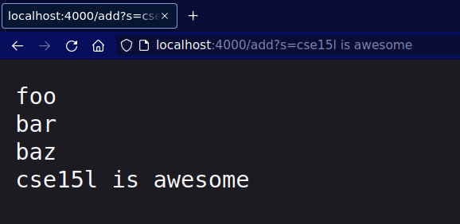
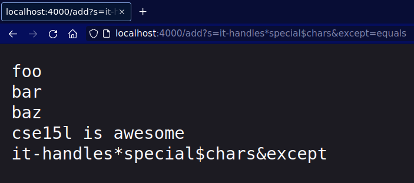
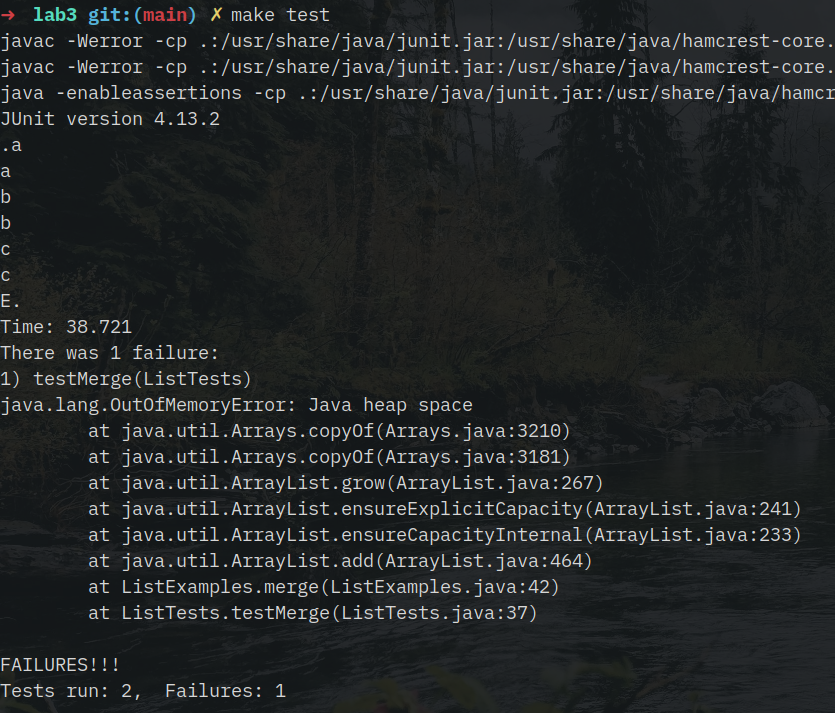
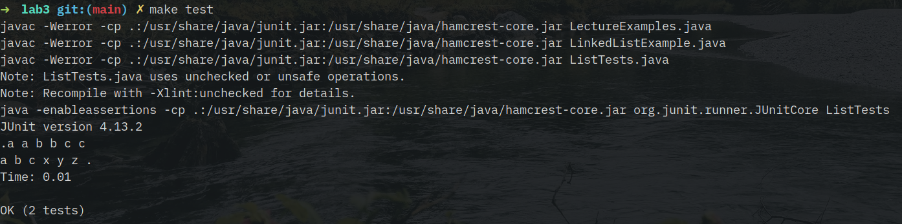

# Week 2 Lab Report

# Part 1
Consider the following simple web server:
```java
import java.io.IOException;
import java.net.URI;
import java.util.ArrayList;

class StringHandler implements URLHandler {
    String output = "";

    StringHandler() { }

    public String handleRequest(URI url) {
        if (url.getPath().contains("/add-message")) {
            String[] parameters = url.getQuery().split("=");
            if (parameters != null && parameters[0].equals("s")) {
                output += parameters[1] + "\n";
                return output;
            } else {
                return "Incorrectly formatted arguments for /add";
            }
        }
        else {
            System.out.println("Path: " + url.getPath());
            return "404 Not Found!";
        }
    }
}

class StringServer {
    public static void main(String[] args) throws IOException {
        if(args.length == 0){
            System.out.println("Missing port number! Try any number between 1024 to 49151");
            return;
        }

        int port = Integer.parseInt(args[0]);

        Server.start(port, new StringHandler());
    }
}
```

Running this on port 4000 with `java StringServer 4000` (after compiling, of course), we can visit it at `http://localhost:4000/add-message?s=`, and we get:




In either of these cases, the `handleRequest` method is called by the Java `Server`, which then adds the string provided in the query to the `output`. The arguments will be a URL object containing the full URL passed in (`new URI("http://localhost:4000/add-message?s=cse 15l is awesome")` in the first example, and `new URI("http://localhost:4000/add-message?s=it-handles*special$chars&except=equals")` in the second). 

After those requests, the value of the `output` variable gets changed to include the string that was passed in. The value of the output string is the text seen in the images.

# Part 2
The `merge` method in the `ListExamples.java` method had quite a subtle bug. Consider the following JUnit test:
```java
@Test
public void testMerge() {
    String[] arr1 = new String[]{"a", "b", "c"};
    List<String> l1 = new ArrayList(Arrays.asList(arr1));

    String[] arr2 = new String[]{"x", "y", "z"};
    List<String> l2 = new ArrayList(Arrays.asList(arr2));

    List<String> ls1 = ListExamples.merge(l1, l1);
    String[] target1 = new String[]{"a", "a", "b", "b", "c", "c"};
    for(int i = 0; i < target1.length; i++) {
        System.out.println(ls1.get(i));
        assertEquals(target1[i], ls1.get(i));
    }

    List<String> ls2 = ListExamples.merge(l1, l2);
    String[] target2 = new String[]{"a", "b", "c", "x", "y", "z"};
    for(int i = 0; i < target2.length; i++) {
        System.out.println(ls2.get(i));
        assertEquals(target2[i], ls2.get(i));
    }
}
```

The first test (`target1`) merges the array `[a, b, c]` with itself, so it expects `[a, a, b, b, c, c]`. The second merges `[a, b, c]` with `[x, y, z]`, so would expect `[a, b, c, x, y, z]` (`target2`). The first test passed, while the second test causes an infinite loop followed by an out-of-memory error:


The infinite loop suggests that one of the loops is not ending, and is perhaps indefinitely appending to the merged list. Indeed, checking this in the code, we find that the third while loop, which appends any excess elements from `list2` to the array, is incrementing the wrong counter:
```java
while(index2 < list2.size()) {
  result.add(list2.get(index2));
  index1 += 1;
}
```
Modifying the code to increment `index2` rather than `index1` fixes the problem.
```java
while(index2 < list2.size()) {
  result.add(list2.get(index2));
  index2 += 1;
}
```



# Part 3
From the Week 2 Lab, I learned how web servers work. While I'd previously used tools like Github Pages and even static site generators, I'd never actually written a server for a webpage that ran on a remote machine before. I found this interesting, because altogether the code is quite simple (admittedly a lot is happening in the Java Standard Library and in the OS under the hood, but still) -- ultimately, a web server really is just a program that takes in a URL and returns an HTML string for the client's browser to render. 
